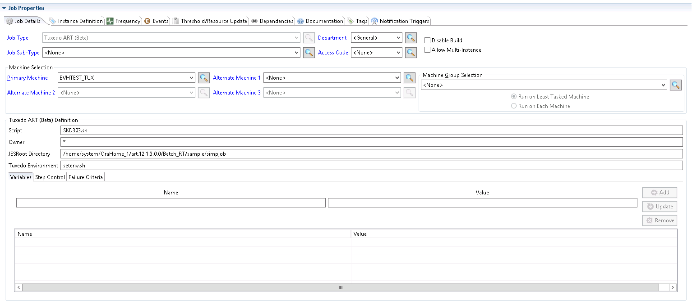

# Executing Tuxedo ART Jobs

The Tuxedo ART Agent uses the Tuxedo ART artjesadmin utility to start a job and to monitor the completion of the job. When starting a job and variables are define, the variable definitions are written to a unique substitution file and the file name is passed to the
artjesadmin utility along with the name of the script to start. During the job initialization sequences, Tuxedo ART performs the variable substitution in the target script.

Once job has been started successfully, the artjesadmin utility returns the unique id associated with the job in the Tuxedo ART environment. This unique id is then used to track the status of the job. When the job completes the job log as well as the JES log information is retrieved and appended to the OpCon job output making it available using the OpCon JORS capability.

It should be noted that the way the Tuxedo ART applications are created it is only possible to use a Tuxedo ART machine for a single application due to the JesRootDirectory configuration. Therefore if Tuxedo ART applications are installed in separate directories within the Tuxedo ART environment, a separate Tuxedo ART machine should be installed for each directory.

The job definitions are made using the Tuxedo ART Job Type. The job definition includes the script name, the job owner, any variable definitions that are to be passed for substitution in the script, any Step control definitions for Agent Feedback and the failure criteria.

## Tuxedo ART Job Type example

The image above shows an example of a Tuxedo ART job type definition. It should be noted that it is only possible to define Tuxedo ART jobs if a Tuxedo ART machine has been defined. For more information on defining Tuxedo ART jobs, refer to [Tuxedo ART Job Details](https://help.smatechnologies.com/opcon/core/latest/Files/Concepts/Tuxedo-ART-Job-Details.md) in the **Concepts** online help.
