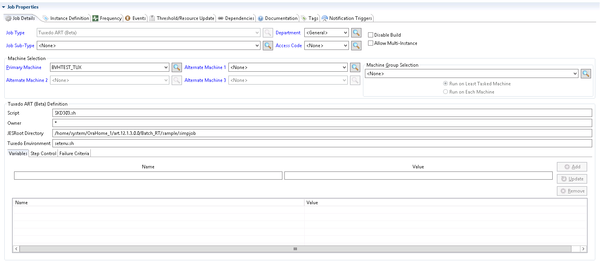

# Running Tuxedo ART jobs

## What is it?

The Tuxedo ART Agent uses the Tuxedo ART `artjesadmin` utility to run and track every Tuxedo ART job scheduled by OpCon. This page describes how a job moves from OpCon submission to completion in the Tuxedo ART environment, and what the agent returns to OpCon along the way.

## How a job runs

When OpCon submits a Tuxedo ART job, the agent does the following:

1. **Prepares the job.** If the job definition includes variables, the agent writes them to a unique substitution file and passes the file name, along with the script name, to `artjesadmin`. Tuxedo ART substitutes the values into the target script during job initialization.
2. **Starts the job.** The agent invokes `artjesadmin` to start the job. On success, `artjesadmin` returns the unique job ID assigned by the Tuxedo ART environment.
3. **Tracks status.** The agent uses the unique job ID to poll job status until the job completes.
4. **Returns output to OpCon.** When the job completes, the agent retrieves the job log and the JES log information, then appends them to the OpCon job output. You can view the output through the OpCon Job Output Retrieval System (JORS).

## Defining a Tuxedo ART job

You define jobs in OpCon using the **Tuxedo ART** job type. Each definition includes:

- **Script name** — The script `artjesadmin` runs.
- **Job owner** — The user under which the job runs.
- **Variable definitions** — Values to substitute into the script during initialization.
- **Step control definitions** — Step names and completion codes that trigger feedback to OpCon. See [Step feedback](./step-feedback.md).
- **Failure criteria** — Conditions that mark the job as failed.

You can only define a Tuxedo ART job if a Tuxedo ART machine has already been defined. For details, refer to [Tuxedo ART Job Details](https://help.smatechnologies.com/opcon/core/job-types/tuxedo-art) in the **Concepts** online help.

### Example

The image above shows an example Tuxedo ART job definition.

## One application per machine

A Tuxedo ART Agent installation is bound to a single Tuxedo ART application by the **JesRootDirectory** setting in **Agent.config**.

:::note
If your environment has multiple Tuxedo ART applications installed in separate directories, install a separate Tuxedo ART Agent for each application directory and define a separate Tuxedo ART machine in OpCon for each.
:::

## Related topics

- [Step feedback](./step-feedback.md) — Return step completion information to OpCon during a running job.
- [Logging](./logging.md) — How job log content is structured and returned to OpCon.
- [Agent.config file configuration](../administration/configuration-file.md) — The **JesRootDirectory**, **SubstitutionFileDirectory**, and `JobStatusCheck*` settings referenced above.

## Glossary

- **artjesadmin** — Tuxedo ART utility the agent uses to start jobs and monitor their status.
- **JesRootDirectory** — Configuration value that ties a Tuxedo ART Agent installation to a single Tuxedo ART application directory.
- **JORS (Job Output Retrieval System)** — OpCon component that retrieves job output information from the agent.
- **Substitution file** — Unique file containing variable definitions that is passed to `artjesadmin` so Tuxedo ART can substitute values into the target script.
