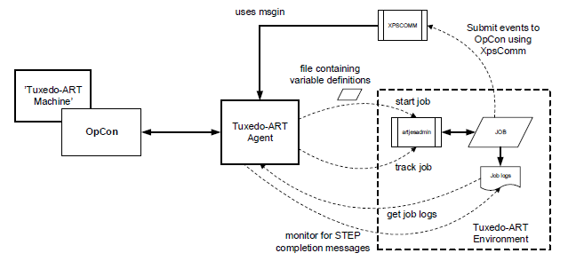

# Introduction

Each Tuxedo ART job is executed as part of the Tuxedo ART Agent within a separate thread which is terminated when the execution is complete. The Tuxedo ART Agent uses the artjesadmin utility to start and monitor the status of the job. When starting a job, it is possible to pass variables as name=value pairs to the Tuxedo ART environment. The variable definitions are passed to the Tuxedo ART environment in a file. The file is read during the job initiation phase and the values in the script are substituted. Standard output and error logs are collected and appended to the job output information which is accessible from the OpCon environment using the JORS capability.

The Tuxedo ART Agent supports the capability to submit events to OpCon using the MSGIN capability. A special script called XPSCOMM can be called from the job script to submit events to OpCon.

## Implementation overview

The Tuxedo ART Agent also supports Agent feedback so that STEP completion messages can be used to submit information to OpCon to process events. The job log is monitored for STEP completion messages and if the STEP is defined and a matching completion is found, the trigger message will be submitted to OpCon.
