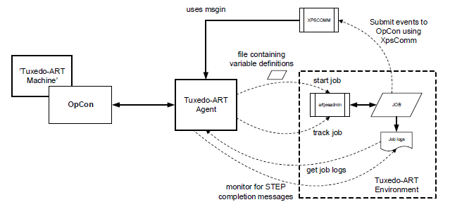

# Introduction

## What is it?

The Tuxedo ART Agent is the OpCon component you install on the Tuxedo ART server so OpCon can schedule and monitor Tuxedo ART Batch jobs. This page describes how the agent interacts with Tuxedo ART and OpCon so you have the context you need before you install or upgrade.

Once installed, the agent provides four capabilities:

- **Run jobs.** The agent uses the Tuxedo ART `artjesadmin` utility to start each job and to monitor its status until completion.
- **Pass variables to scripts.** When you start a job that defines variables, the agent writes them as `name=value` pairs to a substitution file, and Tuxedo ART substitutes the values into the script during job initiation.
- **Return job output.** Standard output and error logs are collected and appended to the OpCon job output, accessible through the OpCon Job Output Retrieval System (JORS).
- **Submit events to OpCon.** The agent supports the MSGIN capability so jobs can submit events back to OpCon. The supplied **XPSCOMM** script can be called from a job script to submit an event, and the agent can return step completion feedback to OpCon when defined steps finish with a matching completion code.

Each Tuxedo ART job runs as part of the Tuxedo ART Agent within a separate thread that ends when the job completes.

## Implementation overview

## Next steps

- [New installation](./new-installation.md) — Install the Tuxedo ART Agent on a UNIX or Linux system and create the machine record in OpCon.
- [Upgrade installation](./upgrade-installation.md) — Upgrade an existing Tuxedo ART Agent installation in place.

## Glossary

- **artjesadmin** — Tuxedo ART utility that the agent uses to start jobs and monitor their status.
- **JORS (Job Output Retrieval System)** — OpCon component used to retrieve job output information from the agent.
- **MSGIN** — File-watcher capability that lets the agent submit events to OpCon by reading event files dropped into a monitored directory.
- **Substitution file** — File the agent writes for each job that contains the job's variable definitions; the file name is passed to `artjesadmin`, and Tuxedo ART substitutes the values into the script during job initiation.
- **XPSCOMM** — Script that can be called from a Tuxedo ART job script to submit events to OpCon through the MSGIN directory.
